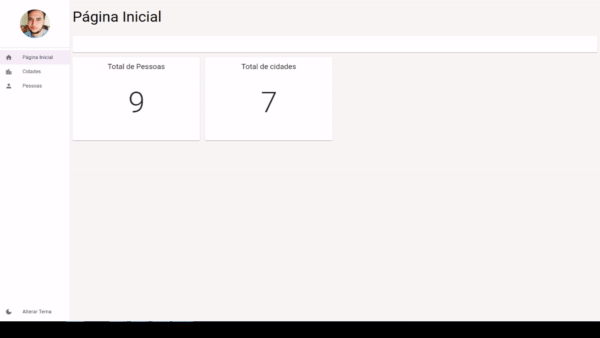
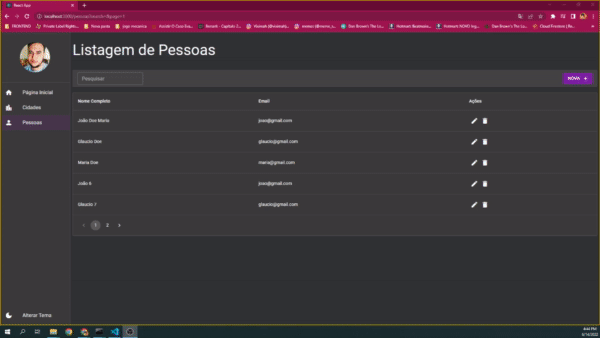

# Dashboard de gerenciamento de pessoas

Projeto com React js e Material UI
e com backend Fake com json-server

## Preview do Projeto

  

## Responsividade

  

## Tecnologias utlizadas

1. React js

   1. Hooks
      1. Context API
      2. useState, useEffect,useCallbacks e useMemo
   2. React Router Dom

2. Material UI
   1. Themas 'Dark e White'
   2. Responsividade com BreakPoints
   3. Componentes em geral das páginas
3. Axios
4. Unform
5. Yup

## Para rodar o projeto

`npm start`
`npm run mock`
